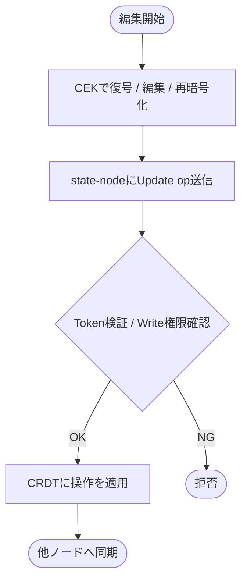
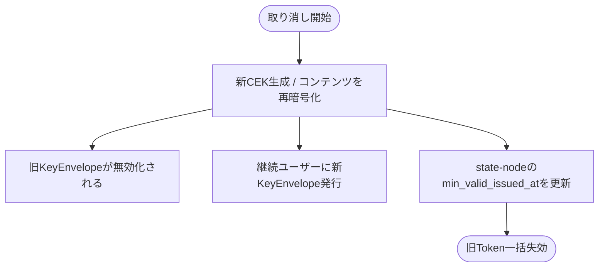

# Monas アーキテクチャ設計

## 目次

1. [Monasとは](#1-monasとは)
2. [背景と課題](#2-背景と課題)
3. [設計の核心原則](#3-設計の核心原則)
4. [システム全体の構成](#4-システム全体の構成)
5. [アクターとロール](#5-アクターとロール)
6. [コンポーネント詳細](#6-コンポーネント詳細)
7. [コンテンツのライフサイクル](#7-コンテンツのライフサイクル)
8. [CIDによるコンテンツアドレッシング](#8-cidによるコンテンツアドレッシング)
9. [ネットワーク設計](#9-ネットワーク設計)
10. [セキュリティモデル](#10-セキュリティモデル)
11. [CRSLとCRDT](#11-crslとcrdt)
12. [プロトコルの境界と将来の拡張](#12-プロトコルの境界と将来の拡張)

---

## 1. Monasとは

Monasは、ユーザーによるデータ主権を実現するための分散プロトコルおよびその実装である。

Monasはプロトコルとして、コンテンツごとの状態管理・暗号化・バージョン管理という振る舞いを定義する。この定義の上で、暗号化論理ファイルシステムをはじめとするさまざまな仕組みを構築可能にし、プライバシーを守りながらアプリケーションを発展させる基盤となることを目指している。

> **Monasは、状態の一貫性と真正性を保証しながら、ユーザーの意図的なデータ接続を可能にする。**

「意図的なデータ接続」とは、どのアプリケーション・組織・サービスに対して、自分のデータのどの範囲を渡すかを、ユーザー自身が決定できることを指す。データを渡す・渡さないという制御だけでなく、どのコンテンツや空間をどの相手と接続するかという粒度での制御を将来的に実現する。

エンドユーザーはMonasを直接操作するのではなく、Monas Protocol上で開発されたアプリケーションを通して関わることを想定している。

---

## 2. 背景と課題

Monasは以下の3つの課題を解決するために設計された。

| 課題 | 内容 |
|------|------|
| **真正性の保証** | 改ざん検知や履歴の検証が不十分で、データの信頼性を欠いている |
| **データの一貫性** | 複数環境やサービス間で整合性が確保されず、断片化や矛盾が生じる |
| **自己管理と信頼性** | 自己主権型の動きは拡大しているが、依然としてプラットフォーム依存が残り、真の信頼性には至っていない |

---

## 3. 設計の核心原則

### コンテンツの振る舞いをプロトコルとして定義する

Monasはコンテンツ単体の振る舞いをプロトコルとして定義する。現時点でMonasが保証する不変条件は以下である。

- コンテンツは**暗号化されている**
- コンテンツは**保存されている**
- コンテンツごとに**Content Networkが存在し管理されている**

コンテンツはCID（Content Identifier）によって識別される。CIDはコンテンツのハッシュから生成されるため、ストレージの種類に依存せず、改ざんすれば値が変わる性質を持つ。これによってストレージをまたいだコンテンツの同一性の保証と、真正性の検証が成立する。

コンテンツのバージョン履歴はハッシュチェーンに近い構造で管理され、複数のノード間での複製によって分散性と一貫性を担保する。

### state-nodeは平文を知らない

state-nodeは名前の通り「状態（state）を管理するノード」であり、データそのものを扱わない。

```
┌──────────────────────────┐   ┌──────────────────────────────┐
│  state-node が知ること      │   │  state-node が知らないこと       │
│                            │   │                               │
│  ・コンテンツID（CID）        │   │  ・コンテンツの中身（平文）        │
│  ・バージョン履歴             │   │  ・暗号化鍵（CEK）              │
│  ・Content Network の構成  │   │  ・ストレージの場所              │
│  ・アクセス権限の状態         │   │                               │
└──────────────────────────┘   └──────────────────────────────┘
```

実データは暗号化された状態でストレージ抽象化層に保存される。state-nodeとストレージ抽象化層の間には直接の依存はなく、CIDという共通言語を通じて間接的に関係する。

### ビザンチン耐性を前提とした設計

誰でもノードに参加できるオープンなネットワークを前提とするため、参加ノードを信頼しない設計をとる。XOR距離によるランダムかつ公平なノード選択により、知り合いのノードだけでContent Networkが構築される可能性を限りなく低くする。

---

## 4. システム全体の構成

```
┌────────────────────────────────────────────────────────────┐
│                     Application Layer                       │
│            （Monas Protocol上に構築されるアプリケーション）        │
└────────────────────────────────┬───────────────────────────┘
                                 │ SDK / HTTP API
┌────────────────────────────────▼───────────────────────────┐
│                        Client Layer                         │
│                                                             │
│   ┌─────────────────────┐   ┌───────────────────────────┐  │
│   │    monas-account     │   │      monas-content         │  │
│   │  （鍵管理・署名・識別）  │   │ （暗号化・共有・バージョン管理）│  │
│   └─────────────────────┘   └──────────────┬────────────┘  │
└──────────────────────────────────────────── │ ─────────────┘
                        CID + op              │    暗号化済みデータ
              ┌─────────────┐        ┌────────▼──────────────┐
              │ state-node  │        │  Storage Abstraction  │
              │（状態・CRDT） │        │    （monas-filesync）   │
              └─────────────┘        └───────────────────────┘
```

state-nodeとストレージ抽象化層はどちらもクライアント層の下に位置するが、互いに直接の依存はない。クライアントが操作の起点となり、それぞれに対して独立したチャネルで通信する。

---

## 5. アクターとロール

Monasには2種類のアクターが存在する。

### Node

- monas-state-nodeを稼働させているサーバー
- P2Pネットワークに参加し、Content Networkの状態管理を担う
- 誰でも参加可能なオープンなネットワーク
- ノード選択はXOR距離によりランダムかつ公平に行われる

### Client

- データを作成・暗号化・共有するユーザー
- NodeにならずにデータをMonas上で管理するだけでもよい
- 暗号化・復号・鍵管理はクライアント側で完結する
- エンドユーザーはMonas上のアプリケーションを通してクライアントとして関わることが多い

1人のユーザーがNodeとClientの両方を担うことも可能である。

---

## 6. コンポーネント詳細

### monas-account

ユーザーの暗号鍵ペアを管理するコンポーネント。

**役割：**
- **署名** → state-node上での操作の正当性を証明する
- **識別子** → 「誰に共有するか」を指定するための公開鍵ベースのID

鍵アルゴリズムとしてP-256（ES256）とK-256をサポートする。公開鍵がIDに埋め込まれた自己完結型の設計（`type:{public_key_hex}`）により、外部のキーレジストリへの依存をなくしている。

**レイヤー構成（DDD）：**
```
domain/         Account, AccountKeyPair
application/    AccountService（create, sign, delete）
infrastructure/ K256KeyPair, P256KeyPair, SledAccountKeyStore
presentation/   Axum HTTP API (port: 4002)
```

### monas-content

コンテンツの暗号化・共有・バージョン管理を担うコンポーネント。

**主な責務：**

| 機能 | 実装 |
|------|------|
| コンテンツ暗号化 | AES-256-CTR（IVランダム生成） |
| 鍵生成・管理 | CEK（Content Encryption Key）の生成・保存・削除 |
| コンテンツアドレッシング | SHA-256によるCID生成 |
| 鍵共有 | HPKE（RFC 9180、DH-KEM P-256）によるCEKのラップ |
| ストレージ抽象化 | monas-filesyncを通じた複数プロバイダー対応 |
| 再暗号化 | アクセス取り消し時の新CEKによる再暗号化 |

**レイヤー構成（DDD）：**
```
domain/         Content, ContentId, Share, Permission, KeyEnvelope
application/    ContentService（CRUD + fetch + reencrypt）
                ShareService（grant, revoke, unwrap_cek）
infrastructure/ AES-256-CTR, HPKE, Sled, monas-filesync
presentation/   Axum HTTP API (port: 4001)
```

### monas-state-node

分散ネットワーク上でコンテンツの状態を管理するノード。

**主な責務：**

| 機能 | 実装 |
|------|------|
| P2Pネットワーク | libp2p（Kademlia DHT / Gossipsub / RequestResponse / mDNS） |
| CRDT状態管理 | crsl-lib（CIDネイティブDAG CRDT） |
| コンテンツ配置 | sha256(content_id)によるDHTキー空間への決定論的配置 |
| 認証 | P-256 ECDSA、自己完結型鍵ID |
| 認可 | JWT + P-256署名によるケイパビリティモデル |
| アクセス制御 | `min_valid_issued_at`によるAuthToken失効管理 |

**レイヤー構成（DDD）：**
```
domain/         ContentNetwork, AccessPolicy, AuthToken, Events
port/           PeerNetwork, ContentRepository, AuthenticationService等の抽象
application/    StateNodeService, ContentSyncService
infrastructure/ libp2p, crsl-lib, Sled, 認証・認可実装
presentation/   Axum HTTP API (port: 8080)
```

### monas-filesync（ストレージ抽象化層）

実データの保存先を抽象化するコンポーネント。

- IPFS、Google Drive、OneDrive、ローカルなど複数プロバイダーに対応
- コンテンツは暗号化済みのまま保存される
- state-nodeはこの層の存在を知らない

---

## 7. コンテンツのライフサイクル

### 作成


### 共有（ユーザーAからユーザーBへ）


### 更新（Write権限を持つユーザーBによる編集）



### アクセス取り消し



---

## 8. CIDによるコンテンツアドレッシング

CIDはMonasにおいて複数の役割を担う。

| CIDの種類 | 生成方法 | 用途 |
|-----------|----------|------|
| `plainCid` | sha256(raw_content) | コンテンツの論理的同一性 |
| `encCid` | sha256(plainCid ∥ 0x00 ∥ ciphertext) | 暗号文の整合性検証 |
| `seriesCid` | 初回のplainCid | コンテンツ系列の追跡 |
| `versionCid` | CRDT操作のCID | バージョン履歴 |

state-nodeはencCidとversionCidのみを保持する。これにより：
- 平文を知らなくても履歴の真正性を検証できる
- ストレージが変わっても同じコンテンツとして認識できる
- ハッシュチェーンにより改ざんを検知できる

---

## 9. ネットワーク設計

### Content Network

コンテンツが作成されると、そのコンテンツ専用のP2Pネットワーク（Content Network）が構築される。

```
コンテンツ作成
     │
     ▼
dhtKey = sha256(content_id)
     │
     ▼
Kademlia: dhtKeyに近いXOR距離のノードをN台選択
     │
     ▼
Content Network（N台のstate-node）構築
     │
     ▼
CRDT操作がNetwork内で同期される
```

XOR距離によるノード選択には以下の特性がある：

- **ランダム性** → 特定のノードが意図的に選ばれることを防ぐ
- **公平性** → 知り合いのノードだけでNetworkが構築される確率が限りなく低い
- **決定論的** → 同じcontent_idに対しては同じノード群が選ばれる

### libp2pプロトコルスタック

| プロトコル | 用途 |
|-----------|------|
| Kademlia DHT | ピア探索・コンテンツルーティング |
| Gossipsub | イベント伝播（ContentCreated, ContentUpdated等） |
| RequestResponse | ノード間の直接通信（CRDT操作の同期） |
| mDNS | ローカルネットワークでのピア探索 |
| TCP / QUIC / WebRTC | トランスポート |

---

## 10. セキュリティモデル

### 暗号化による権限管理

アクセス制御はサービス側のACLではなく暗号鍵によって実現する。

- **アクセスを許可する** = CEKを相手の公開鍵でHPKEラップしてKeyEnvelopeを渡す
- **アクセスを取り消す** = 新しいCEKで再暗号化し、既存のKeyEnvelopeを無効化する

### 認証

state-nodeへの操作には自己完結型の鍵ID（`type:{public_key_hex}`）による署名検証を使用する。公開鍵がIDに埋め込まれているため、外部のキーレジストリへの依存がない。

### 認可（ケイパビリティモデル）

JWT + P-256署名によるAuthTokenで操作の権限を表現する。

```
Token.att = [
  { with: "monas://content/{cid}", can: "write" }
]
```

Token失効は`min_valid_issued_at`による時刻ベースで管理される。オーナーがこの値を更新することで、それ以前に発行されたすべてのTokenを一括失効できる。

### ビザンチン耐性

ネットワークはビザンチン耐性を前提として設計されている。悪意のあるノードが参加してもコンテンツの暗号化によって内容の漏洩は防がれる。XOR距離によるランダムなノード選択が一定の保護を提供する。

### read応答の完全性検証

libp2pのトランスポート認証が保証するのは隣接ホップの相手が本物であることだけで、relay越しに返ってきたデータが正しいかは保証しない。read応答はクライアント側で以下の2段で検証する。

- **payload真正性**: state-nodeはreadに対しcrsl-lib Node全体（CBOR）を返し、クライアントがCIDを再計算して要求した版CIDと照合する。CIDはバイト列そのもののハッシュなので、一致すれば応答は要求した版に束縛され、返した相手が誰か（memberか否か）の確認は不要。さらにCEKでのAES-GCM復号 + 平文CID照合により、payloadが正規のCEKで暗号化された本物であることまで検証される — CEKを持たない攻撃者は復号可能な偽payloadを注入できない。
- **単調性**: クライアントはコンテンツごとに最後に受理した版CIDを記録し、最新読みの結果がその子孫であることをCID検証済みの親リンクだけを辿って確認する。後退していれば、過去の本物の版を「最新」と偽るロールバックとして拒否する（初回はTOFUで受理、探索は上限付きfail-closed）。

member証明（ownerがmemberを認証するトークン）は採用しない。memberはDHT複製配置によりownerの関与なく増減するため「ownerがmember追加時に発行する」経路が成立せず、payload真正性があれば不要でもある。

既知の限界が2つある。

1. **版メタデータの真正性は未保証**: CID照合が保証するのは「バイト列が要求した版CIDに一致すること」であり、「その版が正規の書き込みとして作られたこと」ではない。relay上で暗号文を観測できる攻撃者は、観測済みの本物の暗号文を新しいNodeに包み直し、任意のparentsを詰めた「偽の版」を鋳造できる（payloadは本物なので復号も通る）。単調性チェックはparentsを信頼して祖先を辿るため、last_seenをparentsに含めた偽版でbypassされ得る。本修正はNodeへのowner署名等のtrust anchorであり、crsl-libに及ぶプロトコル変更として別issueで追跡する。
2. **正規memberのstale提示**: 正規memberがクライアント未見の範囲で古い版を「最新」と提示することは検出できない（「より新しい版が無い」という否定的事実は証明不能）。

### 共有コンテンツのCEKライフサイクル

share受信者はKeyEnvelopeの復号成功時にunwrap済みCEKを自デバイスのローカルストアへ保存し、以後は自身もstate-nodeからの検証付きreadで復号できる。CEK・平文がデバイス外に出ることはない（state-nodeは常に暗号文のみを扱う）。

アクセス取り消しの安全性は受信者の鍵破棄（強制不能）ではなくCEKローテーションに依存する。revoke時は再暗号化を先に行い、残存受信者にはローテーション後のCEKでKeyEnvelopeを再発行する。受信者が再発行envelopeを処理すると保存済みCEKが更新され、旧CEKのままでは新しい版を復号できない。

---

## 11. CRSLとCRDT

### 現在のCRDT設計

crsl-libはMonasのために設計されたCIDネイティブなDAG CRDTライブラリである。

```
操作（op）が来る
    │
    ▼
自分のDAGに取り込む（CIDで識別）
    │
    ▼
他のノードへ同期
    │
    ▼
コンフリクト時はLWW（Last-Write-Wins）でマージ
```

コンテンツ本体の意味的なマージは現時点で未実装であり、研究課題として位置づけられている。

### 将来のCRDT拡張

| 機能 | 概要 | 状態 |
|------|------|------|
| FHEによる暗号化マージ | 復号せずにコンテンツをマージする | 研究段階 |
| zk-proofによるマージ証明 | クライアント側マージの正しさをゼロ知識証明で検証する | 研究段階 |

---

## 12. プロトコルの境界と将来の拡張

### Monasプロトコルが定義する範囲

現時点でMonasがプロトコルとして定義・保証するのはコンテンツ単体の振る舞いである。コンテンツの暗号化・保存・Content Networkによる状態管理がその核心となる。この上に何を構築するかは開発者の自由であり、Monasはその基盤として機能する。

### 空間の概念（将来）

Monasが将来目指す「空間」の概念は、ユーザーが自分のデータ領域を自律的にコントロールし、任意の相手・サービスと接続できる状態を指す。ディレクトリや階層構造による複数コンテンツの一括共有、鍵の委譲による空間全体のアクセス制御などがこのレイヤーで実現される。

具体的には、Cryptreeを発展させた暗号化論理ファイルシステムを設計・開発する予定であり、このプロトコルの仕様公開によって誰でも独自の実装が可能となる形を目指している。