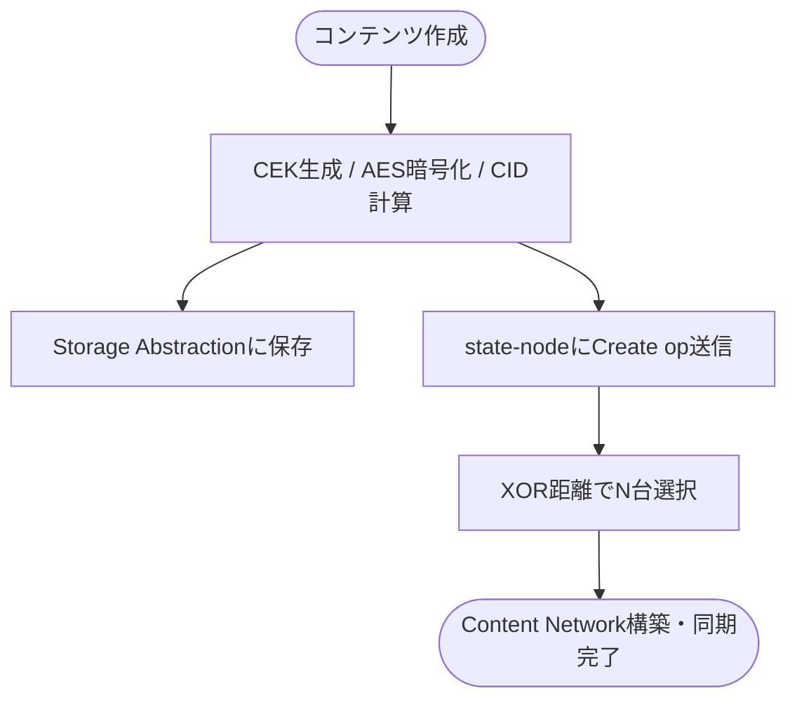
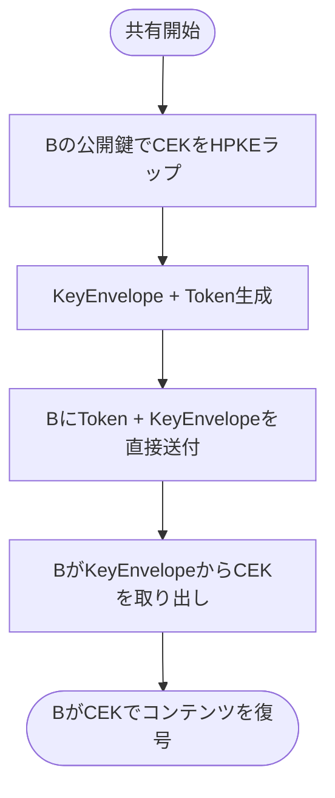
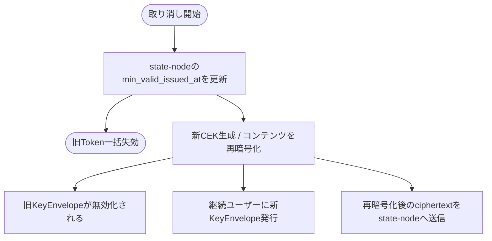

# Monas アーキテクチャ設計

## 目次

1. [Monasとは](#1-monasとは)
2. [背景と課題](#2-背景と課題)
3. [設計の核心原則](#3-設計の核心原則)
4. [システム全体の構成](#4-システム全体の構成)
5. [アクターとロール](#5-アクターとロール)
6. [コンポーネント詳細](#6-コンポーネント詳細)
7. [コンテンツのライフサイクル](#7-コンテンツのライフサイクル)
8. [CIDによるコンテンツアドレッシング](#8-cidによるコンテンツアドレッシング)
9. [ネットワーク設計](#9-ネットワーク設計)
10. [セキュリティモデル](#10-セキュリティモデル)
11. [CRSLとCRDT](#11-crslとcrdt)
12. [プロトコルの境界と将来の拡張](#12-プロトコルの境界と将来の拡張)

---

## 1. Monasとは

Monasは、ユーザーによるデータ主権を実現するための分散プロトコルおよびその実装である。

Monasはプロトコルとして、コンテンツごとの状態管理・暗号化・バージョン管理という振る舞いを定義する。この定義の上で、暗号化論理ファイルシステムをはじめとするさまざまな仕組みを構築可能にし、プライバシーを守りながらアプリケーションを発展させる基盤となることを目指している。

> **Monasは、状態の一貫性と真正性を保証しながら、ユーザーの意図的なデータ接続を可能にする。**

「意図的なデータ接続」とは、どのアプリケーション・組織・サービスに対して、自分のデータのどの範囲を渡すかを、ユーザー自身が決定できることを指す。データを渡す・渡さないという制御だけでなく、どのコンテンツや空間をどの相手と接続するかという粒度での制御を将来的に実現する。

エンドユーザーはMonasを直接操作するのではなく、Monas Protocol上で開発されたアプリケーションを通して関わることを想定している。

---

## 2. 背景と課題

Monasは以下の3つの課題を解決するために設計された。

| 課題 | 内容 |
|------|------|
| **真正性の保証** | 改ざん検知や履歴の検証が不十分で、データの信頼性を欠いている |
| **データの一貫性** | 複数環境やサービス間で整合性が確保されず、断片化や矛盾が生じる |
| **自己管理と信頼性** | 自己主権型の動きは拡大しているが、依然としてプラットフォーム依存が残り、真の信頼性には至っていない |

---

## 3. 設計の核心原則

### コンテンツの振る舞いをプロトコルとして定義する

Monasはコンテンツ単体の振る舞いをプロトコルとして定義する。現時点でMonasが保証する不変条件は以下である。

- コンテンツは**暗号化されている**
- コンテンツは**保存されている**
- コンテンツごとに**Content Networkが存在し管理されている**

コンテンツはCID（Content Identifier）によって識別される。CIDはコンテンツのハッシュから生成されるため、ストレージの種類に依存せず、改ざんすれば値が変わる性質を持つ。これによってストレージをまたいだコンテンツの同一性の保証と、真正性の検証が成立する。

コンテンツのバージョン履歴はハッシュチェーンに近い構造で管理され、複数のノード間での複製によって分散性と一貫性を担保する。

### state-nodeは平文を知らない

state-nodeは名前の通り「状態（state）を管理するノード」であり、データそのものを扱わない。

```
┌──────────────────────────┐   ┌──────────────────────────────┐
│  state-node が知ること      │   │  state-node が知らないこと       │
│                            │   │                               │
│  ・コンテンツID（CID）        │   │  ・コンテンツの中身（平文）        │
│  ・バージョン履歴             │   │  ・暗号化鍵（CEK）              │
│  ・Content Network の構成  │   │  ・ストレージの場所              │
│  ・アクセス権限の状態         │   │                               │
└──────────────────────────┘   └──────────────────────────────┘
```

実データは暗号化された状態でストレージ抽象化層に保存される。state-nodeとストレージ抽象化層の間には直接の依存はなく、CIDという共通言語を通じて間接的に関係する。

### ビザンチン耐性を前提とした設計

誰でもノードに参加できるオープンなネットワークを前提とするため、参加ノードを信頼しない設計をとる。XOR距離によるランダムかつ公平なノード選択により、知り合いのノードだけでContent Networkが構築される可能性を限りなく低くする。

---

## 4. システム全体の構成

```
┌────────────────────────────────────────────────────────────┐
│                     Application Layer                       │
│            （Monas Protocol上に構築されるアプリケーション）        │
└────────────────────────────────┬───────────────────────────┘
                                 │ SDK / HTTP API
┌────────────────────────────────▼───────────────────────────┐
│                        Client Layer                         │
│                                                             │
│   ┌─────────────────────┐   ┌───────────────────────────┐  │
│   │    monas-account     │   │      monas-content         │  │
│   │  （鍵管理・署名・識別）  │   │ （暗号化・共有・バージョン管理）│  │
│   └─────────────────────┘   └──────────────┬────────────┘  │
└──────────────────────────────────────────── │ ─────────────┘
                        CID + op              │    暗号化済みデータ
              ┌─────────────┐        ┌────────▼──────────────┐
              │ state-node  │        │  Storage Abstraction  │
              │（状態・CRDT） │        │    （monas-filesync）   │
              └─────────────┘        └───────────────────────┘
```

state-nodeとストレージ抽象化層はどちらもクライアント層の下に位置するが、互いに直接の依存はない。クライアントが操作の起点となり、それぞれに対して独立したチャネルで通信する。

---

## 5. アクターとロール

Monasには2種類のアクターが存在する。

### Node

- monas-state-nodeを稼働させているサーバー
- P2Pネットワークに参加し、Content Networkの状態管理を担う
- 誰でも参加可能なオープンなネットワーク
- ノード選択はXOR距離によりランダムかつ公平に行われる

### Client

- データを作成・暗号化・共有するユーザー
- NodeにならずにデータをMonas上で管理するだけでもよい
- 暗号化・復号・鍵管理はクライアント側で完結する
- エンドユーザーはMonas上のアプリケーションを通してクライアントとして関わることが多い

1人のユーザーがNodeとClientの両方を担うことも可能である。

---

## 6. コンポーネント詳細

### monas-account

ユーザーの暗号鍵ペアを管理するコンポーネント。

**役割：**
- **署名** → state-node上での操作の正当性を証明する
- **識別子** → 「誰に共有するか」を指定するための公開鍵ベースのID

鍵アルゴリズムとしてP-256（ES256）とK-256をサポートする。公開鍵がIDに埋め込まれた自己完結型の設計（`type:{public_key_hex}`）により、外部のキーレジストリへの依存をなくしている。

**レイヤー構成（DDD）：**
```
domain/         Account, AccountKeyPair
application/    AccountService（create, sign, delete）
infrastructure/ K256KeyPair, P256KeyPair, SledAccountKeyStore
presentation/   Axum HTTP API (port: 4002)
```

### monas-content

コンテンツの暗号化・共有・バージョン管理を担うコンポーネント。

**主な責務：**

| 機能 | 実装 |
|------|------|
| コンテンツ暗号化 | AES-256-GCM（AEAD、12バイトランダムnonce。保存形式は `nonce \|\| ciphertext \|\| tag`） |
| 鍵生成・管理 | CEK（Content Encryption Key）の生成・保存・削除 |
| コンテンツアドレッシング | SHA-256によるCID生成 |
| 鍵共有 | HPKE（RFC 9180、DH-KEM P-256）によるCEKのラップ |
| ストレージ抽象化 | monas-filesyncを通じた複数プロバイダー対応 |
| 再暗号化 | アクセス取り消し時の新CEKによる再暗号化 |

**レイヤー構成（DDD）：**
```
domain/         Content, ContentId, Share, Permission, KeyEnvelope
application/    ContentService（CRUD + fetch + reencrypt）
                ShareService（grant, revoke, unwrap_cek）
infrastructure/ AES-256-GCM, HPKE, Sled, monas-filesync
presentation/   Axum HTTP API (port: 4001)
```

### monas-state-node

分散ネットワーク上でコンテンツの状態を管理するノード。

**主な責務：**

| 機能 | 実装 |
|------|------|
| P2Pネットワーク | libp2p（Kademlia DHT / Gossipsub / RequestResponse / mDNS） |
| CRDT状態管理 | crsl-lib（CIDネイティブDAG CRDT） |
| コンテンツ配置 | sha256(content_id)によるDHTキー空間への決定論的配置 |
| 認証 | P-256 ECDSA、自己完結型鍵ID |
| 認可 | JWT + P-256署名によるケイパビリティモデル |
| アクセス制御 | `min_valid_issued_at`によるAuthToken失効管理 |

**レイヤー構成（DDD）：**
```
domain/         ContentNetwork, AccessPolicy, AuthToken, Events
port/           PeerNetwork, ContentRepository, AuthenticationService等の抽象
application/    StateNodeService, ContentSyncService
infrastructure/ libp2p, crsl-lib, Sled, 認証・認可実装
presentation/   Axum HTTP API (port: 8080)
```

### monas-filesync（ストレージ抽象化層）

実データの保存先を抽象化するコンポーネント。

- IPFS、Google Drive、OneDrive、ローカルなど複数プロバイダーに対応
- コンテンツは暗号化済みのまま保存される
- state-nodeはこの層の存在を知らない

---

## 7. コンテンツのライフサイクル

### 作成



### 共有（ユーザーAからユーザーBへ）




### 更新（Write権限を持つユーザーBによる編集）


### アクセス取り消し

取り消しは2つの独立した権限を同時に断つ必要がある。**復号できること**（CEK を持っていること）と、**書き込めること**（有効な委譲 Token を持っていること）である。CEKのローテーションは前者しか止めない。後者を止めるにはstate-nodeの`min_valid_issued_at`を進めて既発行Tokenを一括失効させる。



失効を先に行うのは、逆順だと「再暗号化してから失効するまでの窓」で取り消し済みの相手が書き込めてしまうためである。先に失効させておけば、後段が失敗してローカル状態を巻き戻しても、余分な失効が残るだけで害はない。

`min_valid_issued_at`は時刻ベースの一括失効なので、**残存する受信者のTokenも巻き添えで失効する**（判定は排他なので、取り消しと同じ秒に発行されたTokenも失効する）。呼び出し側は取り消し後に、残存受信者へ新しいKeyEnvelopeと新しいTokenの両方を配り直す必要がある。SDKは`RevokeShareOutput`で再発行KeyEnvelope（`reissued_envelopes`）と失効時刻（`token_invalidated_at`）の両方を返す。

取り消しはACL・CEK・ローカルciphertext・state node状態にまたがるload-modify-saveであり、そのどれにもversion CASが無い。したがって**同じcontentへの取り消しはcontent単位で直列化する**。並行させると、双方が同じShareを読んで後勝ちでsaveし片方の受信者削除が消える（lost update）、異なるCEKが同じ`key_epoch`として配られる、といった分岐が起こる。SDKのコントローラはgatewayから共有され複数リクエストから同時に呼ばれるため、これは理論上の話ではない。現状の直列化はプロセス内に閉じており、複数gatewayプロセスからの並行取り消しには対応しない — そこまで守るにはShare・CEK・ciphertextを1つのtransactional CASにまとめるか、state node側にCASを置く必要がある。

---

## 8. CIDによるコンテンツアドレッシング

CIDはMonasにおいて複数の役割を担う。

| CIDの種類 | 生成方法 | 用途 |
|-----------|----------|------|
| `plainCid` | sha256(raw_content) | コンテンツの論理的同一性 |
| `encCid` | sha256(plainCid ∥ 0x00 ∥ ciphertext) | 暗号文の整合性検証 |
| `seriesCid` | 初回のplainCid | コンテンツ系列の追跡 |
| `versionCid` | CRDT操作のCID | バージョン履歴 |

state-nodeはencCidとversionCidのみを保持する。これにより：
- 平文を知らなくても履歴の真正性を検証できる
- ストレージが変わっても同じコンテンツとして認識できる
- ハッシュチェーンにより改ざんを検知できる

---

## 9. ネットワーク設計

### Content Network

コンテンツが作成されると、そのコンテンツ専用のP2Pネットワーク（Content Network）が構築される。

```
コンテンツ作成
     │
     ▼
dhtKey = sha256(content_id)
     │
     ▼
Kademlia: dhtKeyに近いXOR距離のノードをN台選択
     │
     ▼
Content Network（N台のstate-node）構築
     │
     ▼
CRDT操作がNetwork内で同期される
```

XOR距離によるノード選択には以下の特性がある：

- **ランダム性** → 特定のノードが意図的に選ばれることを防ぐ
- **公平性** → 知り合いのノードだけでNetworkが構築される確率が限りなく低い
- **決定論的** → 同じcontent_idに対しては同じノード群が選ばれる

### libp2pプロトコルスタック

| プロトコル | 用途 |
|-----------|------|
| Kademlia DHT | ピア探索・コンテンツルーティング |
| Gossipsub | イベント伝播（ContentCreated, ContentUpdated等） |
| RequestResponse | ノード間の直接通信（CRDT操作の同期） |
| mDNS | ローカルネットワークでのピア探索 |
| TCP / QUIC / WebRTC | トランスポート |

---

## 10. セキュリティモデル

### 暗号化による権限管理

アクセス制御はサービス側のACLではなく暗号鍵によって実現する。

- **アクセスを許可する** = CEKを相手の公開鍵でHPKEラップしてKeyEnvelopeを渡す
- **アクセスを取り消す** = 新しいCEKで再暗号化し、既存のKeyEnvelopeを無効化する

### 認証

state-nodeへの操作には自己完結型の鍵ID（`type:{public_key_hex}`）による署名検証を使用する。公開鍵がIDに埋め込まれているため、外部のキーレジストリへの依存がない。

### 認可（ケイパビリティモデル）

JWT + P-256署名によるAuthTokenで操作の権限を表現する。

```
Token.att = [
  { with: "monas://content/{cid}", can: "write" }
]
```

Token失効は`min_valid_issued_at`による時刻ベースで管理される。オーナーがこの値を更新することで、それ以前に発行されたすべてのTokenを一括失効できる。判定は`iat > min_valid_issued_at`の**排他**であり、等値は無効とする — どちらも秒精度なので、失効と同じ秒に発行されたTokenが失効の前後どちらだったかは区別できず、等値を有効扱いにすると取り消したはずの相手のTokenが生き残る。誤る方向としては、失効直後の同一秒に発行されたTokenまで弾く方が安全である（呼び出し側は1秒後に取り直せば済むが、逆方向は取り消し済みの相手にアクセスを与え続ける）。なお`0`は「一度も失効していない」を意味し、全Tokenを受理する。

役割分担は「権限があること = Token（owner署名のケイパビリティ）」「今このリクエストを送っているのが宛先本人であること = リクエスト署名（Proof of Possession）」の2層である。リクエスト署名の対象はトークン種別・bodyの有無によらず同一構造で、domain separationタグに続けて操作・リソース・timestamp・body digestを長さ前置で連結する（`monas-request-v1:<len>:<操作>:<len>:<リソース>:<timestamp>:<len>:<body digest>`）。**bodyを伴う書き込みでも操作とリソースに束縛される**ため、あるコンテンツ向けに取得した署名を別コンテンツや別操作へ転用することはできない。リプレイ防御は2層で担う。第1に署名内のtimestampの鮮度チェック（5分窓）で、これは「古い署名を無限に使い回せない」ことを保証する。timestampの無いリクエストは認証エラーとなる（サーバ時刻へのフォールバックはしない）。第2に、**mutationについては受理した署名を記録して2度目の提示を拒否する**。対象は書き込み系の6操作（`create` / `update` / `delete` / `invalidate` / `manage` / `revoke`）である。鮮度チェックだけでは窓の中で同じ署名を何度でも通せてしまい、これらは冪等でないため、それは単なる重複ではなく状態の巻き戻しになる — 署名済みの旧ciphertext更新を正規の更新の後に再送すると、サーバはそれを「現在のheadを親とする新しい操作」としてcommitし、古い内容が最新版になる。

リクエストの同一性には**署名対象メッセージと、検証後のcanonical principal**を使う（`SHA256(len(principal) ‖ principal ‖ signing_message)`、長さ前置はprincipalとメッセージの境界を付け替えられないようにするため）。principalは「リクエスト署名の検証に使う鍵」そのもので、自己完結型の鍵IDならその値、委譲JWTなら`aud`である。メッセージは既に操作・リソース・timestamp・body digestすべてに束縛されているので、nonceのような新しいフィールドをワイヤ形式へ足す必要がない。記録の保持期間は鮮度窓と同じでよい（窓の外へ出た署名は記録が無くても鮮度チェックで落ちる）ため、記録は無制限には育たない。読み取りは冪等なのでこの記録の対象外である。

**同一性の入力に署名バイト列を一切含めないことが要点である。** ECDSAはmalleableで、有効な`(r, s)`に対し`(r, n−s)`も同じメッセージ・同じ鍵で検証を通る。したがって署名のdigestをIDにすると、1つの承認済みリクエストが2つのIDを持ち、`s`を反転した署名を送り直すだけで消費記録をすり抜けて再適用できてしまう。これは**リクエスト署名だけの話ではない** — 委譲JWTの末尾セグメントもまたECDSA署名なので、生のトークン文字列をIDの入力にすると同じ迂回が成立する（claims・`aud`・リクエスト署名はすべて同じまま、トークンのバイト列だけが変わる）。principalを使うのはこのためである。

この2層構成は[RFC 9449（DPoP）§11.1](https://www.rfc-editor.org/rfc/rfc9449.html#section-11.1)と同じ形である。同RFCはサーバに対し、proofを「秒〜分のオーダーの比較的短い期間」だけ受理することを要求したうえで、**別途**その期間中はproofの識別子を保存して二重使用を防ぐことを推奨し、「厳格に運用すればこのsingle-useチェックはreplayに対する非常に強い防御となる」と述べている。鮮度チェックだけでは不十分であることが、仕様レベルで明示されている。

**鮮度窓の値（300秒）の根拠。** 上限はAWS SigV4が同じ役割に使っている値（「リクエストはtimestampから5分以内にAWSへ到達しなければならない」）に合わせたもので、RFC 9449の言う「秒〜分」の範囲に収まる。下限を決めるのは正当なリクエストが到達するのに要する時間で、gatewayを1ホップ、さらにstate-nodeのrelay（ピアあたりの予算は`PEER_NETWORK_TIMEOUT` = 30秒）が入り、その前にDHT探索が挟まることもあり、failoverは候補を順に試す。数十秒は現実的にあり得るため、300秒は余裕を大きく取った値である。

つまりこの窓は**計測に基づいて詰めた値ではなく、緩めに置いた値**である。捕捉されたread署名がどれだけの間再利用可能かを直接決めるため、実際のリクエスト遅延を計測したうえで縮める価値はある。ただしrelayのfailover予算を下回ると正当なreadが落ち始めるので、そこが下限になる。

したがってTokenはTTL内で何度でも再利用できる一方、**個々のリクエスト署名は使い切り**である。JWT自体の署名検証は、受信したワイヤ上のバイト列（`header.payload`セグメント）に対して行う。

**relayも転送前に消費する。** relayはaccess policyを持たないのでcredentialをmemberへ転送して判断を委ねるが、それだとmember側にしか記録が残らず、同じ署名をrelayへ送り直すたびに「まだ見ていないmember」へ振り分けられて再適用できてしまう。ただし**消費記録を書く前に、relay自身が署名を暗号学的に検証する**。relayにできない（policyを要する）のは*認可*だけで、tokenの署名とリクエスト署名の検証は policy 無しで行えるためである。

この順序は防御の多重化ではなく必須である。request idは署名対象メッセージとprincipalから導かれ、その構成要素（操作・リソース・timestamp・body digest・`aud`）は**すべて公開情報**である。検証前に記録すると、鍵も有効な署名も持たない第三者が、対象ユーザーの正規リクエストのidをゴミ署名で先に焼き潰せる — bodyの無い`delete`は現在秒を入れるだけでメッセージが完全に予測でき、毎秒繰り返せばそのユーザーはこのrelay経由で何も更新できなくなる。

**ネットワーク全体での使い切りは未達である。** 記録はノードごとに独立で、同じ署名を複数のレプリカへ送ればそれぞれで1回ずつ受理される。各レプリカは受信のたびに*そのノードの*現在headとauthorで新しいoperationを生成するため、これは「同一CRDT operationの重複配送」ではなく**別々の新規operation**であり、CRDTの冪等性は当てはまらない。古い暗号文が新しいheadの子として再commitされ、最新版へ戻る巻き戻しは、別レプリカまたは再起動後には依然成立する。またデフォルト実装はプロセス内に閉じており、再起動をまたいで5分以内に届いた同一署名も防げない。protocol-levelのoperation IDによる全レプリカでのdedupが必要で、issue #65 で追跡している。

### ビザンチン耐性

ネットワークはビザンチン耐性を前提として設計されている。悪意のあるノードが参加してもコンテンツの暗号化によって内容の漏洩は防がれる。XOR距離によるランダムなノード選択が一定の保護を提供する。

#### relay先の信頼度

コンテンツを保持しないノードがリクエストを受けた場合、実際のmemberへrelayする。このときのrelay先候補には**由来の異なる2種類**があり、扱いを分ける必要がある。

| 由来 | 内容 | 扱い |
|---|---|---|
| ローカルの`ContentNetwork`レコード | 自ノードをmemberとして名指しした`ContentCreated` / `ContentNetworkManagerAdded`イベント由来。**発行元は認証済みだが、member集合そのものは発行元の主張** | ローカルレコード |
| DHTの近傍探索 | `sha256(content_id)`に近いというだけ。コンテンツとの関連は何も示されていない | 未証明 |

ここで「ローカルレコード」は**owner署名によるattestationではない**。イベントにowner署名は無く、member集合は発行元の自己申告である。検証されているのは**発行元**の方で、Gossipsubを`MessageAuthenticity::Signed` + `ValidationMode::Strict`で運用しているため著者フィールドは必須かつ署名検証済みであり、これを次の2点に束縛している。

- `ContentCreated`は、名乗っている`creator_node_id`本人からの発行でなければ拒否する
- member集合を変える`ContentNetworkManagerAdded` / `ContentNetworkManagerRemoved`は、こちらが保持しているそのネットワークの既存memberからの発行でなければ拒否する
- `ContentDeleted`は上記に加えて、名乗っている`deleted_by_node_id`本人からの発行であることも確認する。ただしこのイベントは発行元を*自分で*名乗るので、その照合だけでは「認証済みなら誰でも通る」ことにしかならない。ローカルレコードを消せるのは既存memberだけである
- `ContentUpdated`は、名乗っている`updated_node_id`本人からの発行でなければ拒否する

なお束縛に使うのはGossipsubの`Message::source`（**発行元**）であって`propagation_source`（直前の転送元）ではない。meshは多段転送するため、転送元で判定すると正規の多段配送を落としつつ偽装を通してしまう。

**この束縛には2つの抜けがある。** 1つは後述する「最初の1通」で、照合すべき既存membershipが無いため受理せざるを得ない。もう1つは**発行元を特定できなかった場合**で、そのときorigin検証はスキップされる（`verify_source_is_existing_member`は`source_peer_id`が`None`ならそのまま`Ok`を返す）。Gossipsub経路は`Signed` + `Strict`運用なので実際には常に発行元が付くが、`handle_sync_event`を呼ぶ側が認証済みの値を渡す責任を負っている、という構造である。

**候補が返した401/403は、出自によらず早期打ち切りの根拠にはしない。** 権威にすると、DHTキーの近くにPeer IDを置いた1台が403を返すだけであらゆるread/writeを止められてしまう（可用性への攻撃）。また正規のmemberであっても、policyの複製が終わっていない部分同期状態なら403を返し得るため、健全なレプリカへのfailoverを潰さないためにも継続が必要である。ただし答えとしては保持し、他の候補から何も得られなければそれを返す。

ローカルレコード由来のmemberについては、以前は「実policyに対する評価結果だから」として打ち切っていた。**これは撤回した。** レコード自体が最初の1通で植え付けられる（照合すべき既存membershipが無いため受理せざるを得ない）以上、その競争に勝った攻撃者は候補リストに載り、その403で正規callerのreadを恒久的に止められる — 未証明ピアについて防いでいるのと同じ攻撃が、ローカルレコード経路でも成立してしまう。早期打ち切りを戻せるのはowner署名付きmembership（#63）が入ってからである。継続のコストは「本当に拒否された場合に残り候補ぶんの往復が増える」ことに限られ、可用性側に倒すのが正しい方向である（callerはどのみち拒否され、それが少し遅くなるだけ）。

一方で、**credentialは未証明の候補へ転送してよい。** relayはcallerのtokenとリクエスト署名をそのまま転送するが、これは設計どおりであり、認可判断はmember側が実policyに対して行う。転送しなければmember側で認可できない。

これが安全なのは、認可が**Proof of Possession**だからである。tokenは自己完結型の鍵ID（公開鍵そのもの）か委譲JWTで、後者の`aud`（宛先）もまた自己完結型の鍵IDである。リクエスト署名は**その`aud`の鍵に対して**検証されるため、tokenと署名の両方を傍受した相手も、`aud`の秘密鍵を持たない以上、新しいリクエストを作れない。傍受した署名そのものも操作・リソース・body digest・timestampに束縛されており、mutationについてはさらに使い切りである。したがって未証明の候補へ渡っても、その相手ができるのは「同じreadを鮮度窓の内に再実行する」ことに限られる — readは冪等で、しかもその候補はrelay経由で既に暗号文を見ているため、新たに得られる情報はない。

候補リストを未証明だからといって切り詰めることはしない。切り詰めれば正当なmemberへのfailoverが減って可用性が落ちる一方、DHT距離順で先頭に来る相手は上限があろうと credential を受け取るため、機密性は改善しないからである。

残る課題は**member discoveryそのもの**である。発行元の認証によって「無関係なノードが勝手にレコードを植え付ける」ことは防げるが、次の2つの穴はプロトコル変更（owner署名付きmembership）でしか塞げず、未実装である。

- そのcontentについて**最初の**レコードは、照合すべき既存membershipが無いため受け入れざるを得ない
- 認証済みのmemberであれば、任意のmember集合を主張できる

したがって「このノードが本当にこのcontentのmemberである」ことを暗号学的に確認する仕組みは依然として無く、ローカルレコード / 未証明の区別はそこへ至るまでの近似にとどまる。

### read応答の完全性検証

libp2pのトランスポート認証が保証するのは隣接ホップの相手が本物であることだけで、relay越しに返ってきたデータが正しいかは保証しない。read応答はクライアント側で以下を検証する。

- **payload真正性**: state-nodeはreadに対しcrsl-lib Node全体（CBOR）を返し、クライアントがCIDを再計算して要求した版CIDと照合する。CIDはバイト列そのもののハッシュなので、一致すれば応答は要求した版に束縛され、返した相手が誰か（memberか否か）の確認は不要。さらにCEKでのAES-GCM復号 + 平文CID照合により、payloadが正規のCEKで暗号化された本物であることまで検証される — CEKを持たない攻撃者は復号可能な偽payloadを注入できない。

member証明（ownerがmemberを認証するトークン）は採用しない。memberはDHT複製配置によりownerの関与なく増減するため「ownerがmember追加時に発行する」経路が成立せず、payload真正性があれば返した相手の身元確認は不要でもある。

**版の真正性とロールバック耐性は現時点では保証していない。** CID照合が保証するのは「バイト列が要求した版CIDに一致すること」であり、「その版が正規の書き込みとして作られたこと」「それが最新であること」ではない。relay上で暗号文を観測できる攻撃者は、観測済みの本物の暗号文を新しいNodeに包み直し、任意のparentsを詰めた「偽の版」を鋳造できる（payloadは本物なので復号も通る）。

クライアント側で「最後に受理した版」を記録して後退を拒否する単調性チェックも検討したが、採用しない。偽のparentsを詰めた版でbypassできるため本質的な防御にならない一方、結果整合性のもとでは正当なsync遅延（分散システムでは正常な挙動）と攻撃を応答単体で区別できず、正規のreadを壊す誤検知と、クライアント側の永続状態という負債だけが残るためである。

版の真正性は、Nodeまたは版メタデータへのowner（または権限を持つwriter）署名というtrust anchorで解決する。これはcrsl-libに及ぶプロトコル変更であり、別issueで追跡する。それが入るまで、readの保証範囲は「返されたpayloadが、要求した版に対して真正であること」までである。

### 共有コンテンツのCEKライフサイクル

share受信者はKeyEnvelopeの復号成功時にunwrap済みCEKを自デバイスのローカルストアへ保存し、以後は自身もstate-nodeからの検証付きreadで復号できる。CEK・平文がデバイス外に出ることはない（state-nodeは常に暗号文のみを扱う）。

**KeyEnvelopeは送信者認証付き（HPKE Authモード）でラップされる。** 送信者の秘密鍵がwrap計算に混ざり、受信者は送信者の公開鍵を使ってunwrapする — 送信者が本物でなければ復号自体が失敗するため、別途の署名は不要。受信者は最初にunwrapに成功した送信者公開鍵をcontentごとにピン留めし（TOFU）、以後のenvelopeはピン済みの鍵でのみ検証する。これにより、**2通目以降**については、平文を知る第三者が自分の鍵で整合するenvelopeを鋳造して受信者の保存CEKを上書き破壊する攻撃を防げる。

ただし**初回は送信者認証ではない**。ピンが無い時点では呼び出し側が渡した公開鍵をそのまま検証鍵に使うため、HPKE Authが証明するのは「その鍵の持ち主がこのenvelopeを作った」ことだけで、「contentのownerが作った」ことではない。平文を知る第三者が自分の鍵で整合するenvelopeを作り、正規のenvelopeより先にピンを取ることは現状防げない（以後、正規のenvelopeがピン不一致で弾かれる）。初回の送信者鍵をowner identityまたは検証済み委譲トークンのissuerへ束縛する修正は、版の真正性と同じくownerを信頼の根に置く話であり、別issueで追跡する。

wrapのAADには `(content_id, recipient_key_id, key_epoch)` が束縛され、いずれかを書き換えたenvelopeは復号に失敗する。`key_epoch` はCEKの鍵世代（rotationごとに+1）で、受信者は記録済み世代より古いenvelopeを拒否する — rotation前の正規envelopeを再送して保存CEKを旧世代へ巻き戻すreplay攻撃はこれで防がれる。

受信者側のローカル状態では、**送信者鍵・鍵世代・CEKの3つ組を1レコードにまとめ、単一のcompare-and-swapで入れ替える**。守るべき不変条件は「3つ組が常に整合していること」であって世代番号だけではないため、これらを別ストアに分けて別々にcommitすると、世代をCASで守っても壊れる — 世代Nの処理がピンを読んだ後に世代N+1の処理がピンとCEKを進め、その後で世代Nの処理がCEKだけを書き戻せば、`ピン=N+1 / CEK=N` という復号不能な状態が残る。3つ組が1レコードなら、この割り込みは構造的に起こり得ない。CEKストアはこの権威レコードから導出されるキャッシュとして扱い、書き損じてもKeyEnvelopeの再処理で埋め直せる。**readはこの権威レコードのCEKを優先して使う。** キャッシュへの書き込みはCASの外にあるため、世代Nのハンドラが権威レコードのCASを終えた直後に停止し、その間に世代N+1が権威レコードとキャッシュを進め、その後Nが再開してキャッシュだけをNへ戻す、という順序逆転が起こり得る。権威レコードから直接引けば、この巻き戻りはreadに影響しない（自分で作成したコンテンツには送信者ピンが無いので、その場合だけキャッシュを引く）。

アクセス取り消しの安全性は受信者の鍵破棄（強制不能）ではなくCEKローテーションに依存する。revoke時は再暗号化を先に行い、残存受信者にはローテーション後のCEK・進んだkey_epochでKeyEnvelopeを再発行する。受信者が再発行envelopeを処理すると保存済みCEKが更新され、旧CEKのままでは新しい版を復号できない。

---

## 11. CRSLとCRDT

### 現在のCRDT設計

crsl-libはMonasのために設計されたCIDネイティブなDAG CRDTライブラリである。

```
操作（op）が来る
    │
    ▼
自分のDAGに取り込む（CIDで識別）
    │
    ▼
他のノードへ同期
    │
    ▼
コンフリクト時はLWW（Last-Write-Wins）でマージ
```

コンテンツ本体の意味的なマージは現時点で未実装であり、研究課題として位置づけられている。

### 将来のCRDT拡張

| 機能 | 概要 | 状態 |
|------|------|------|
| FHEによる暗号化マージ | 復号せずにコンテンツをマージする | 研究段階 |
| zk-proofによるマージ証明 | クライアント側マージの正しさをゼロ知識証明で検証する | 研究段階 |

---

## 12. プロトコルの境界と将来の拡張

### Monasプロトコルが定義する範囲

現時点でMonasがプロトコルとして定義・保証するのはコンテンツ単体の振る舞いである。コンテンツの暗号化・保存・Content Networkによる状態管理がその核心となる。この上に何を構築するかは開発者の自由であり、Monasはその基盤として機能する。

### 空間の概念（将来）

Monasが将来目指す「空間」の概念は、ユーザーが自分のデータ領域を自律的にコントロールし、任意の相手・サービスと接続できる状態を指す。ディレクトリや階層構造による複数コンテンツの一括共有、鍵の委譲による空間全体のアクセス制御などがこのレイヤーで実現される。

具体的には、Cryptreeを発展させた暗号化論理ファイルシステムを設計・開発する予定であり、このプロトコルの仕様公開によって誰でも独自の実装が可能となる形を目指している。