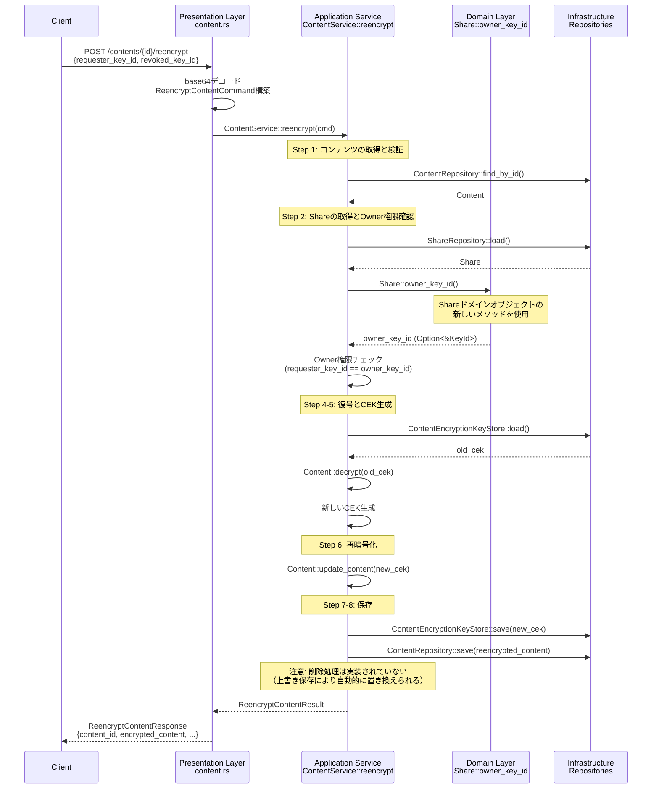
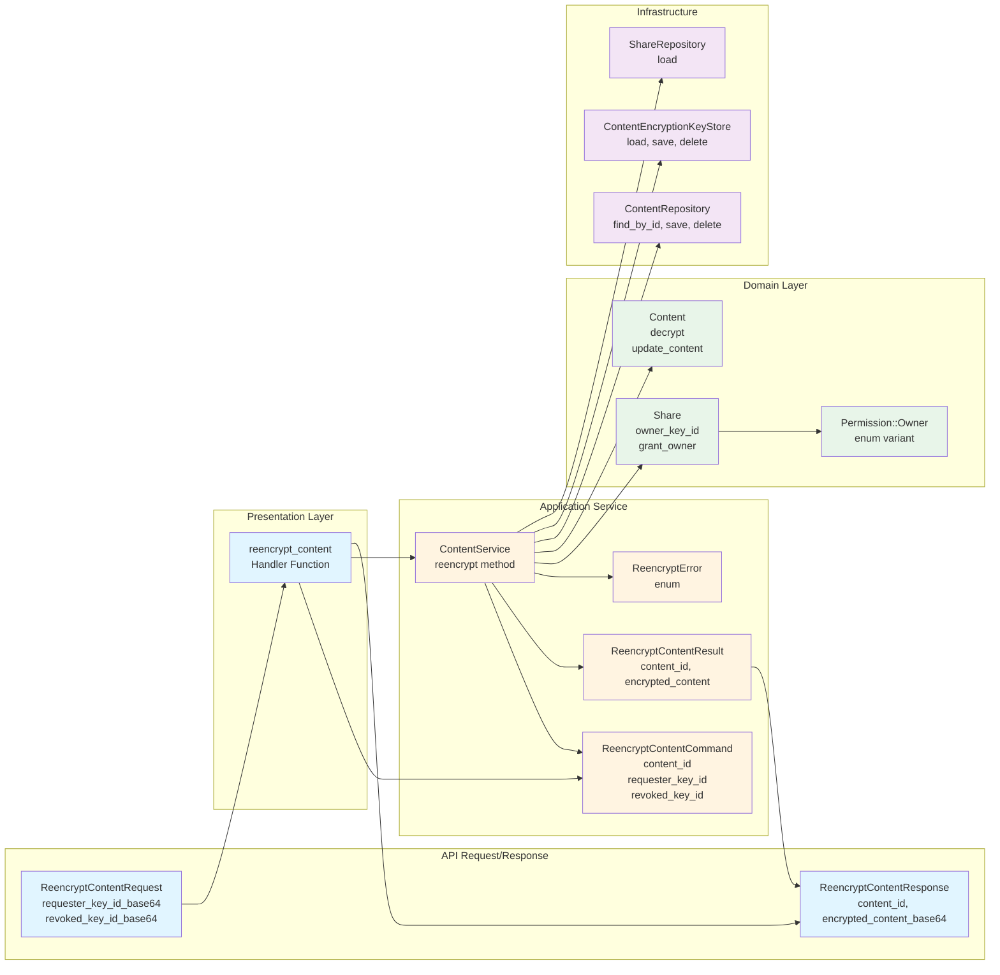

# コンテンツ再暗号化機能の設計書

## 概要

Owner権限を持つユーザが、特定のkey idを持つRead権限ユーザのアクセスを拒否するために、コンテンツを再暗号化する機能を実装します。

**要件**: 
- 再暗号化処理完了後、ciphertext（暗号化されたコンテンツ）が返される
- 新しいCEKはローカルに保存される（既存の`create()`と同様）
- monas-sdk側で、残っている正当なユーザに対して`ShareService::grant_share()`を呼び出すことで、再暗号化されたコンテンツに対する新しい`KeyEnvelope`を生成できる必要があります（Pull型、既存の`share_content` APIと同様）

**想定使用箇所**: この再暗号化操作は、`monas-sdk/src/controller/share.rs`の`revoke_share`メソッド（264行目付近）で使用されます。共有を取り消した後、取り消されたユーザがコンテンツにアクセスできないようにするため、コンテンツを再暗号化する必要があります。

## Owner権限の実装について

### 設計方針

1. **Owner権限の実装**: Owner権限を持つユーザのみが再暗号化を実行できる
2. **権限の階層**: Owner > Write > Read の階層を定義
3. **権限管理**: Owner権限を持つユーザのみが権限の付与・削除を行える
4. **将来の移行可能性**: 将来的にmonas-state-nodeが権限管理を引き継ぐ場合の移行計画を考慮

### 実装範囲

- **ドメイン層**: `Permission::Owner`を追加、`ShareRecipient::permissions`に`Permission::Owner`を含める方式を採用
- **アプリケーション層**: Owner権限チェックを追加
- **再暗号化機能**: Owner権限チェックを優先的に使用

### 実装の位置づけ

- Owner権限の実装は本実装として扱う
- `Share`は`monas-content`で管理されているため、Owner権限も`monas-content`で管理する
- クライアント側でOwner権限を確認できる必要がある
- 将来的にmonas-state-nodeが権限管理を引き継ぐ場合の移行計画は残しておく

### Owner権限の設計

Owner権限は`ShareRecipient::permissions()`に`Permission::Owner`を含める方式で実装する。`ShareRecipient::permissions()`は既に以下の用途で使用されている：

- **APIレスポンス**: `get_share` APIで権限情報を返す（`presentation/share.rs`）
- **権限チェック**: `ShareRecipient::can_read()` と `can_write()` の内部実装で使用
- **権限の取得**: `Share::permissions_of()` の内部実装で使用

この既存パターンに従い、Owner権限も`ShareRecipient::permissions()`に含めることで、クライアント側での権限確認が容易になり、既存の権限確認パターンと一貫性を保つ。

## 処理フロー

### 概要

再暗号化処理は以下の9つのステップで構成されます：

1. **APIリクエスト受信**: Owner権限保持者が`requester_key_id`と`revoked_key_id`を指定して再暗号化APIを呼び出す
2. **事前確認**: コンテンツの取得と検証（存在確認、削除状態確認、Share取得、Owner権限確認、更新確認）を実行
3. **更新確認**: メタデータの更新時刻を確認（暫定的な実装方針に従う、現時点では詳細未定）
4. **復号**: 取得したコンテンツを既存のCEKで復号し、プレーンテキストを取得
5. **CEK生成**: 新しいCEKを生成
6. **再暗号化**: プレーンテキストを新しいCEKで再暗号化し、新しいContentオブジェクトを作成
7. **CEK保存**: 新しいCEKを`ContentEncryptionKeyStore`に保存
8. **Content保存**: 再暗号化されたContentを`ContentRepository`に保存（失敗時はCEKを削除してロールバック）
9. **結果返却**: 暗号化されたコンテンツ（ciphertext）を含む`ReencryptContentResult`を返す

**注意**: 現時点では、古いContentIdのContentとCEKの削除処理は実装されていません。理由は、再暗号化では常に再暗号化前と同じContentIdであるため、`HashMap::insert()`による上書き保存により古いデータは自動的に新しいデータに置き換えられるためです。

### 詳細実装

#### 1. APIリクエスト受信（プレゼンテーション層）

**ファイル**: `monas-content/src/presentation/content.rs`

**APIエンドポイント**: `POST /contents/{id}/reencrypt`
- URLパスの`{id}`部分が`content_id`を表す
- 既存のAPIパターン（`/contents/{id}/fetch`、`/contents/{id}/decrypt`など）に従う
- Axumの`Path`エクストラクタでURLパスから`content_id`を取得

**ルーティング定義**:
  ```rust
pub fn routes() -> Router<Arc<AppState>> {
    Router::new()
        .route("/contents", post(create_content))
        .route(
            "/contents/{id}",
            patch(update_content).delete(delete_content),
        )
        .route("/contents/{id}/fetch", get(fetch_content))
        .route("/contents/{id}/decrypt", post(decrypt_with_cek))
        .route("/contents/{id}/reencrypt", post(reencrypt_content))  // 追加
}
```

**実装**:
```rust
#[derive(Deserialize)]
pub struct ReencryptContentRequest {
    pub requester_key_id_base64: String,  // Owner権限を持つユーザのKeyId（base64エンコード）
    pub revoked_key_id_base64: String,    // 削除されたKeyId（base64エンコード）
}

async fn reencrypt_content(
    State(state): State<Arc<AppState>>,
    Path(content_id_str): Path<String>,  // URLパスからcontent_idを取得
    Json(req): Json<ReencryptContentRequest>,
) -> Result<Json<ReencryptContentResponse>, (StatusCode, String)> {
    let content_id = ContentId::new(content_id_str);
    
    // requester_key_id_base64をbase64デコードしてKeyIdに変換
    let requester_key_id = decode_key_id_base64(
        &req.requester_key_id_base64,
        "requester_key_id_base64",
    )?;
    
    // revoked_key_id_base64をbase64デコードしてKeyIdに変換
    let revoked_key_id = decode_key_id_base64(
        &req.revoked_key_id_base64,
        "revoked_key_id_base64",
    )?;
    
    // ReencryptContentCommandを構築
    let cmd = ReencryptContentCommand {
        content_id,
        requester_key_id,
        revoked_key_id,
    };
    
    // ContentService::reencrypt()を呼び出し
    let result = state.content_service.reencrypt(cmd).map_err(|e| {
        let status = match e {
            ReencryptError::ContentNotFound => StatusCode::NOT_FOUND,
            ReencryptError::ContentDeleted => StatusCode::NOT_FOUND,
            ReencryptError::ShareNotFound => StatusCode::NOT_FOUND,
            ReencryptError::OwnerPermissionDenied(..) => StatusCode::FORBIDDEN,
            _ => StatusCode::BAD_REQUEST,
        };
        (status, e.to_string())
    })?;
    
    // ReencryptContentResponseに変換
    let metadata = &result.metadata;
    let encrypted_content_base64 = BASE64_STANDARD.encode(&result.encrypted_content);
    
    Ok(Json(ReencryptContentResponse {
        content_id: result.content_id.as_str().to_string(),
        series_id: result.series_id.as_str().to_string(),
        name: metadata.name().to_string(),
        path: metadata.path().to_string(),
        updated_at: metadata.updated_at().to_rfc3339(),
        encrypted_content_base64,
    }))
}
```

**注意**: `decode_key_id_base64()`は`monas-content/src/presentation/mod.rs`で定義されているヘルパー関数です。

**処理**:
- `content_id`: URLパス`/contents/{id}/reencrypt`の`{id}`部分から取得（`Path<String>`から`ContentId`型に変換）
- `requester_key_id_base64`と`revoked_key_id_base64`をbase64デコードして`KeyId`に変換
- `ReencryptContentCommand`を構築
- `ContentService::reencrypt()`を呼び出し
- `ReencryptContentResponse`に変換（`encrypted_content`をbase64エンコード、`updated_at`をISO 8601形式に変換）
- エラーハンドリング（適切なHTTPステータスコードを返却）

**`requester_key_id`について**:

- **現時点**: `requester_key_id`は必要（Owner権限チェックに使用）
  - `monas-content`側でOwner権限チェックを実施するため、`requester_key_id`が必要
  - APIリクエストとコマンドに含める
  
- **将来（monas-state-node移行後）**: `requester_key_id`は不要（権限チェックはmonas-state-node側で実施）
  - 権限チェックは`monas-state-node`側で実施されるため、`monas-content`側では`requester_key_id`は不要
  - APIリクエストから`requester_key_id`を削除し、`monas-state-node`側で権限チェック後に再暗号化APIを呼ぶ

**出力**:
  ```rust
#[derive(Serialize)]
pub struct ReencryptContentResponse {
    pub content_id: String,
    pub series_id: String,
    pub name: String,
    pub path: String,
    pub updated_at: String,                    // ISO 8601形式
    pub encrypted_content_base64: String,     // 暗号化されたコンテンツ（base64エンコード）
      }
  ```

**注意**: `new_cek_base64`は含まない（既存の`create()`と同様に、CEKはローカルに保存されるのみ）


#### 2. 事前確認（アプリケーションサービス層・ドメイン層）

##### 2.1 コンテンツの取得（アプリケーションサービス層）

- **インフラストラクチャ層（ポート）**: `ContentRepository::find_by_id(&content_id)` を呼び出し
- **戻り値**: `Result<Option<Content>, ContentRepositoryError>`
- **期待される値**:
  - 成功時: `Ok(Some(Content))` - 既存の`Content`構造体（`monas-content/src/domain/content/content.rs`）
- コンテンツが存在しない場合: `Ok(None)`
- **エラー処理**: `Ok(None)`の場合、`ReencryptError::ContentNotFound`エラーを返す

##### 2.2 削除状態の確認（ドメイン層）

- **ドメイン層**: `Content::is_deleted()` を呼び出し
- **戻り値**: `bool`
- **エラー処理**: `true`の場合、`ReencryptError::ContentDeleted`エラーを返す

##### 2.3 Shareの取得（アプリケーションサービス層）

- **インフラストラクチャ層（ポート）**: `ShareRepository::load(&content_id)` を呼び出し
- **戻り値**: `Result<Option<Share>, ShareRepositoryError>`
- **期待される値**:
  - 成功時: `Ok(Some(Share))` - 既存の`Share`構造体（`monas-content/src/domain/share/share.rs`）
    - Owner権限を持つユーザは、`ShareRecipient::permissions`に`Permission::Owner`を含む
- Shareが存在しない場合: `Ok(None)`
- **エラー処理**: `Ok(None)`の場合、`ReencryptError::ShareNotFound`エラーを返す

##### 2.4 権限の確認（ドメイン層）

- **ドメイン層**: `Share::owner_key_id()` を呼び出し（Owner権限の確認）
- **実装**: `ShareRecipient`の`permissions`に`Permission::Owner`を含むKeyIdを検索
- **戻り値**: `Option<&KeyId>`
- **処理**:
- Owner権限が設定されている場合（`Option::Some(owner_key_id)`）:
    - `owner_key_id == requester_key_id` を確認
    - 不一致の場合: `ReencryptError::OwnerPermissionDenied` エラーを返す
- Owner権限が未設定の場合（`Option::None`）:
    - `ReencryptError::OwnerPermissionDenied` エラーを返す（Owner権限を前提とするため、Write権限での代替は行わない）

##### 2.5 更新確認（ドメイン層）

**注意**: Owner権限があれば、存在するユーザを削除するために再暗号化を実行できる。`revoked_key_id`がShareに存在するかどうかはチェックしない。

- **ドメイン層**: `Content::metadata()` を呼び出し
- **戻り値**: `&Metadata` - 既存の`Metadata`構造体（`monas-content/src/domain/content/metadata.rs`）
- **ドメイン層**: `Metadata::updated_at()` を呼び出し
- **戻り値**: `DateTime<Utc>`
- **更新確認のロジック**: 暫定的な実装方針に従う（現時点では詳細未定）

#### 4. 取得したコンテンツを既存のCEKで復号（アプリケーションサービス層）

- **前提**: Step 2.1で取得した`Content`オブジェクトを使用
- **インフラストラクチャ層（ポート）**: `ContentEncryptionKeyStore::load(&content_id)` を呼び出し
- **ドメイン層**: 取得した`Content`オブジェクトに対して`Content::decrypt(&old_cek, &encryptor)` を呼び出し
- **戻り値**: プレーンテキスト（`Vec<u8>`）
- **エラー処理**:
  - CEKが存在しない場合: `ReencryptError::MissingContentEncryptionKey`エラーを返す
  - 復号に失敗した場合: `ReencryptError::Domain(ContentError)`エラーを返す

#### 5. 新しいCEKを生成（アプリケーションサービス層）

- **インフラストラクチャ層（ポート）**: `ContentEncryptionKeyGenerator::generate()` を呼び出し
- **戻り値**: `ContentEncryptionKey`

#### 6. 再暗号化されたContentを作成（ドメイン層）

- **ドメイン層**: `Content::update_content(raw_content, &id_generator, &new_cek, &encryptor)` を呼び出し
- **戻り値**: 新しい`ContentId`を持つ`Content`オブジェクト（`series_id`は維持される）
- **重要**: `Content::update_content()`は内部で暗号化を行うため、事前に`ContentEncryption::encrypt()`を呼び出す必要はない（二重暗号化を避けるため）
- **エラー処理**: 失敗時、`ReencryptError::Domain(ContentError)`エラーを返す

#### 7-8. コミットフェーズ（永続化）

**重要**: メモリ上での準備（Step 3-5）が完了してから、以下の永続化操作を実行します。

##### 7. 新しいContentIdでCEKを保存（アプリケーションサービス層）

- **インフラストラクチャ層（ポート）**: `ContentEncryptionKeyStore::save(new_content_id, &new_cek)` を呼び出し
- **エラー処理**: 失敗時、エラーを返す（まだ何も保存されていないため、ロールバック不要）

##### 8. 新しいContentIdでContentを保存（アプリケーションサービス層）

- **インフラストラクチャ層（ポート）**: `ContentRepository::save(new_content_id, &reencrypted_content)` を呼び出し
- **エラー処理とロールバック**: Content保存が失敗した場合、新しいContentIdのCEKを削除する（失敗しても問題なし）
  - **注**: Contentが存在しないため、CEKは参照されず実質的に無効。削除しなくても問題ないが、ストレージの無駄を防ぐために削除する
  - InMemory実装の場合: プロセス終了時にメモリが解放される
  - Sled実装の場合: 明示的に削除しない限り残るが、参照されないため問題ない

**保存操作のアトミック性保証**: Step 7とStep 8の保存操作については、アトミック性を保証する。Content保存が失敗した場合、新しいContentIdのCEKを削除する（失敗しても問題なし）。Contentが存在しないため、CEKは参照されず実質的に無効となる。

**削除操作について（将来の実装）**: 
- **現時点では削除処理は実装されていません**
- **理由**: 再暗号化では常に再暗号化前と同じContentIdであるため、`HashMap::insert()`による上書き保存により古いデータは自動的に新しいデータに置き換えられます
  - `ContentRepository::save()`は`HashMap::insert()`を使用（monas-content/src/infrastructure/repository.rs:25）
  - `ContentEncryptionKeyStore::save()`は`HashMap::insert()`を使用（monas-content/src/infrastructure/key_store.rs:30）
- **将来の実装**: 暗号文からContentIdを生成する場合、再暗号化時にContentIdが変わるため、以下の削除処理が必要になります：
  - 古いContentIdのContentを削除（ContentIdが変わった場合のみ）
  - 古いContentIdのCEKを削除（ContentIdが変わった場合のみ）
  - 削除操作はアトミック性を保証しない。保存操作（Step 6、7）が成功すれば、削除操作が失敗しても問題ない

#### 8. ciphertextを返す（アプリケーションサービス層）

- **アプリケーションサービス層**: `ReencryptContentResult` を構築して返す（新規追加）
- **戻り値**: `Result<ReencryptContentResult, ReencryptError>`
- **`ReencryptContentResult`構造体（新規追加）**:
  - `content_id: ContentId` - 再暗号化後の新しいContentId
  - `series_id: ContentId` - 論理的な系列ID（維持される）
  - `metadata: Metadata` - 更新されたメタデータ
  - `encrypted_content: Vec<u8>` - 暗号化されたコンテンツ（ciphertext）
- **重要**:
  - `encrypted_content`は`Content::encrypted_content()`から取得した暗号化されたコンテンツのバイト列
  - 新しいCEKはローカルに保存されるが、返り値には含まれない（既存の`create()`と同様）
  - KeyEnvelopeの生成は`ShareService::grant_share()`で行う（Pull型）


## 実装内容

### 1. ドメイン層（Owner権限の実装）

#### 1.1 Permission enumの拡張

**ファイル**: `monas-content/src/domain/share/share.rs`

**実装**:
```rust
#[derive(Debug, Clone, PartialEq, Eq, serde::Serialize, serde::Deserialize)]
pub enum Permission {
    Read,
    Write,
    Owner,  // Owner権限（将来的にmonas-state-nodeが権限管理を引き継ぐ場合の移行計画を考慮）
}

impl Permission {
    pub fn can_read(perms: &[Permission]) -> bool {
        perms.iter().any(|p| matches!(
            p, 
            Permission::Read | Permission::Write | Permission::Owner
        ))
    }

    pub fn can_write(perms: &[Permission]) -> bool {
        perms.iter().any(|p| matches!(
            p, 
            Permission::Write | Permission::Owner
        ))
    }

    // Owner権限チェック用のヘルパーメソッド（将来的にmonas-state-nodeが権限管理を引き継ぐ場合の移行計画を考慮）
    pub fn can_manage_permissions(perms: &[Permission]) -> bool {
        perms.iter().any(|p| matches!(p, Permission::Owner))
    }
}
```


#### 1.2 Share構造体の拡張

**ファイル**: `monas-content/src/domain/share/share.rs`

**実装**:
```rust
impl Share {
    // Owner権限を付与（将来的にmonas-state-nodeが権限管理を引き継ぐ場合の移行計画を考慮）
    pub fn grant_owner(&mut self, key_id: KeyId) -> Result<ShareEvent, ShareError> {
        // 既にOwner権限を持つユーザが存在するか確認
        if self.owner_key_id().is_some() {
            return Err(ShareError::InvalidOperation(
                "Owner already exists".to_string()
            ));
        }
        
        // ShareRecipientにOwner権限を追加
        if let Some(recipient) = self.recipients.get_mut(&key_id) {
            // 既存のShareRecipientにOwner権限を追加
            if !recipient.permissions().contains(&Permission::Owner) {
            recipient.permissions.push(Permission::Owner);
            }
        } else {
            // 新しいShareRecipientを作成してOwner権限を付与
            let recipient = ShareRecipient::new(
                key_id.clone(),
                vec![Permission::Owner],
            );
            self.recipients.insert(key_id.clone(), recipient);
        }
        
        Ok(ShareEvent::RecipientGranted {
            content_id: self.content_id.clone(),
            key_id,
            permissions: vec![Permission::Owner],
        })
    }

    // Owner権限を持つKeyIdを取得（ShareRecipientから導出、将来的にmonas-state-nodeが権限管理を引き継ぐ場合の移行計画を考慮）
    pub fn owner_key_id(&self) -> Option<&KeyId> {
        self.recipients.iter()
            .find(|(_, recipient)| {
                recipient.permissions().contains(&Permission::Owner)
            })
            .map(|(key_id, _)| key_id)
    }

    // 権限管理可能かを確認（将来的にmonas-state-nodeが権限管理を引き継ぐ場合の移行計画を考慮）
    fn can_manage_permissions(&self, key_id: &KeyId) -> bool {
        self.recipients
                .get(key_id)
                .map(|r| Permission::can_manage_permissions(r.permissions()))
                .unwrap_or(false)
    }
}
```

**設計方針**:
- `Share`構造体に`owner_key_id`フィールドは追加しない（`ShareRecipient`から導出）
- `ShareRecipient`構造体は変更不要（`permissions: Vec<Permission>`に`Permission::Owner`を含める）

**注意**: `grant_read()`、`grant_write()`、`revoke()`メソッドへの権限チェック追加は**行わない**。将来的にmonas-state-nodeが権限管理を引き継ぐ場合の移行計画を考慮。

### 2. アプリケーションサービス層

#### 2.0 コマンド/結果構造体の追加

**ファイル**: `monas-content/src/application_service/content_service/command.rs`

**実装**:
```rust
/// コンテンツ再暗号化ユースケースの入力。
#[derive(Debug)]
pub struct ReencryptContentCommand {
    pub content_id: ContentId,
    pub requester_key_id: KeyId,
    pub revoked_key_id: KeyId,
}

/// コンテンツ再暗号化ユースケースの出力。
#[derive(Debug)]
pub struct ReencryptContentResult {
    pub content_id: ContentId,                    // 再暗号化後の新しいContentId
    pub series_id: ContentId,                     // 論理的な系列ID（維持される）
    pub metadata: Metadata,                       // 更新されたメタデータ
    pub encrypted_content: Vec<u8>,                // 暗号化されたコンテンツ（ciphertext）
}
```

#### 2.1 再暗号化処理の実装（整合性保証含む）

**ファイル**: `monas-content/src/application_service/content_service/service.rs`

**実装**:
```rust
pub fn reencrypt(&self, cmd: ReencryptContentCommand) -> Result<ReencryptContentResult, ReencryptError> {
    // Step 1: コンテンツの取得と検証
    let content = self
        .content_repository
        .find_by_id(&cmd.content_id)
        .map_err(ReencryptError::ContentRepository)?
        .ok_or(ReencryptError::ContentNotFound)?;

    if content.is_deleted() {
        return Err(ReencryptError::ContentDeleted);
    }

    // Step 2: Shareの取得とOwner権限確認
    let share = self
        .share_repository
        .load(&cmd.content_id)
        .map_err(|_| ReencryptError::ShareNotFound)?
        .ok_or(ReencryptError::ShareNotFound)?;

    let owner_key_id = share.owner_key_id().ok_or_else(|| {
        ReencryptError::OwnerPermissionDenied(
            cmd.requester_key_id.clone(),
            cmd.content_id.as_str().to_string(),
        )
    })?;

    if owner_key_id != &cmd.requester_key_id {
        return Err(ReencryptError::OwnerPermissionDenied(
            cmd.requester_key_id.clone(),
            cmd.content_id.as_str().to_string(),
        ));
    }

    // Step 3: 更新確認（暫定的な実装方針に従う、現時点では詳細未定）
    // 注意: Owner権限があれば、存在するユーザを削除するために再暗号化を実行できる
    // revoked_key_idがShareに存在するかどうかはチェックしない
    let _metadata = content.metadata();
    let _updated_at = content.metadata().updated_at();

    // === 準備フェーズ（メモリ上で実行） ===
    
    // Step 4: 既存のCEKで復号
    let old_content_id = content.id().clone();
    let old_cek = self
        .cek_store
        .load(&old_content_id)
        .map_err(ReencryptError::KeyStore)?
        .ok_or(ReencryptError::MissingContentEncryptionKey)?;

    let plaintext = content
        .decrypt(&old_cek, &self.encryptor)
        .map_err(ReencryptError::Domain)?;
    
    // Step 5: 新しいCEKを生成
    let new_cek = self.key_generator.generate();
    
    // Step 6: 再暗号化されたContentを作成
    let (reencrypted_content, _event) = content
        .update_content(
            plaintext,
            &self.content_id_generator,
            &new_cek,
            &self.encryptor,
        )
        .map_err(ReencryptError::Domain)?;
    
    let new_content_id = reencrypted_content.id().clone();
    
    // === コミットフェーズ（永続化） ===
    
    // Step 7: 新しいContentIdでCEKを保存
    self.cek_store
        .save(&new_content_id, &new_cek)
        .map_err(ReencryptError::KeyStore)?;
    
    // Step 8: 新しいContentIdでContentを保存
    if let Err(e) = self
        .content_repository
        .save(&new_content_id, &reencrypted_content)
    {
        // ロールバック: 新しいContentIdのCEKを削除（失敗しても問題なし）
        // 注: Contentが存在しないため、CEKは参照されず実質的に無効。
        // 削除しなくても問題ないが、ストレージの無駄を防ぐために削除する。
        let _ = self.cek_store.delete(&new_content_id);
        return Err(ReencryptError::ContentRepository(e));
    }

    // 注意: 現状、古いContentIdのContentとCEKの削除処理は不要
    // 理由: 再暗号化では常に再暗号化前と同じcontent idであるので、上書き保存により古いデータは自動的に新しいデータに置き換えられる:
    // - Contentの場合: ContentRepository::save()はHashMap::insert()を使用（monas-content/src/infrastructure/repository.rs:25）
    // - CEKの場合: ContentEncryptionKeyStore::save()はHashMap::insert()を使用（monas-content/src/infrastructure/key_store.rs:30）
    // したがって、Step 7とStep 8の上書き保存により、古いContentとCEKは自動的に新しいものに置き換えられる

    // 将来の実装: 暗号文からContentIdを生成する場合の削除処理
    // 将来的には暗号文からContentIdを生成するため、再暗号化時にContentIdが変わるので、
    // 以下の削除処理が必要になる:
    // Step 9: 古いContentIdのContentを削除（ContentIdが変わった場合のみ）
    // if old_content_id != new_content_id {
    //     let _ = self.content_repository.delete(&old_content_id);
    // }
    //
    // Step 10: 古いContentIdのCEKを削除（ContentIdが変わった場合のみ）
    // if old_content_id != new_content_id {
    //     let _ = self.cek_store.delete(&old_content_id);
    // }

    // Step 9: 結果を返す
    let encrypted_content = reencrypted_content
        .encrypted_content()
        .ok_or(ReencryptError::MissingEncryptedContent)?
        .clone();

    Ok(ReencryptContentResult {
        content_id: new_content_id,
        series_id: reencrypted_content.series_id().clone(),
        metadata: reencrypted_content.metadata().clone(),
        encrypted_content,
    })
}
```

**保存操作のアトミック性保証**:
- メモリ上で全ての準備（復号、CEK生成、再暗号化）を完了してから永続化を開始
- 新しいContentIdでCEKとContentを保存し、Content保存が失敗した場合、新しいContentIdのCEKを削除する（失敗しても問題なし）
- Contentが存在しないため、CEKは参照されず実質的に無効となる
- これにより、「CEKの生成はできたけどContent保存はうまくできなかった」などの整合性を満たせない状態が発生しない

**削除操作について（将来の実装）**:
- **現時点では削除処理は実装されていません**
- **理由**: 再暗号化では常に再暗号化前と同じContentIdであるため、`HashMap::insert()`による上書き保存により古いデータは自動的に新しいデータに置き換えられます
- 将来の実装（暗号文からContentIdを生成する場合）では、削除操作が必要になりますが、アトミック性を保証しません
- 保存操作が成功すれば、削除操作が失敗しても問題ない
- 古いContentIdのデータ（ContentとCEK）は参照されないため、実質的に無効となる

**注意**: `ContentRepository`トレイトに`delete`メソッドを追加する必要があります。既存の実装を確認し、必要に応じて追加します。

#### 2.3 ShareServiceの変更（オプション）

**注意**: `ShareService::grant_share()`と`revoke_share()`へのOwner権限チェック追加は**行わない**。将来的にmonas-state-nodeが権限管理を引き継ぐ場合の移行計画を考慮。

### 3. エラーハンドリング

**ファイル**: `monas-content/src/application_service/content_service/mod.rs` または `error.rs`

**実装**:
```rust
#[error("owner permission denied: requester_key_id={requester_key_id}, content_id={content_id}")]
OwnerPermissionDenied { 
    requester_key_id: KeyId, 
    content_id: ContentId 
},
```


### 4. 保存操作のアトミック性を保証する設計

#### 4.1 設計方針

**設計方針**: 保存操作（Step 6、7）のみアトミック性を保証する。削除操作（Step 8、9）はアトミック性を保証しない。

**採用理由**:
1. **保存操作の重要性**: 新しいContentIdでCEKとContentを保存することは重要。Content保存が失敗した場合、CEKを削除してロールバックする必要がある
2. **削除操作の非重要性**: 削除操作が失敗しても問題ない。古いContentIdのデータ（ContentとCEK）は、メモリ解放やGCのタイミングで削除される
3. **実装の簡素化**: 削除操作のアトミック性を保証する必要がないため、ロールバック処理が不要になり、実装が簡素化される

**実装**: 詳細は「2.2 再暗号化処理の実装（整合性保証含む）」を参照

### 5. テスト戦略

Owner権限の実装に関するテスト：

1. **正常系**: Owner権限を持つユーザが再暗号化を実行
2. **異常系**: Owner権限が設定されていない場合、再暗号化不可（`OwnerPermissionDenied`エラー）
3. **異常系**: Owner権限が設定されている場合、Owner権限を持たないユーザは再暗号化不可（`OwnerPermissionDenied`エラー）

#### 5.1 保存操作のアトミック性保証のテスト

以下のテストケースを追加して、保存操作のアトミック性が保証されていることを確認：

1. **正常系**: 保存操作が成功する場合
   - 前提条件: Step 6とStep 7の保存操作が成功
- 期待結果: 
    - 新しいContentIdでCEKとContentが保存される
     - 新しいContentIdで保存されたデータ（ContentとCEK）が存在する
    - 整合性が保たれる
     - 削除操作（Step 8、9）が失敗しても問題ない（メモリ解放やGCのタイミングで削除される）

2. **異常系**: 新しいContentIdでCEK保存が失敗した場合
- 前提条件: `ContentEncryptionKeyStore::save()`がエラーを返す
   - 期待結果: 何も保存されない（古いContentIdのデータ（ContentとCEK）はそのまま）、エラーが返される

3. **異常系**: 新しいContentIdでContent保存が失敗した場合
- 前提条件: `ContentRepository::save()`がエラーを返す
   - 期待結果: 
     - 新しいContentIdのCEKが削除される（削除が失敗しても問題なし、Contentが存在しないためCEKは参照されず実質的に無効）
     - 古いContentIdのデータ（ContentとCEK）はそのまま
     - エラーが返される

4. **整合性チェック**: 再暗号化後、ContentとCEKの整合性を確認
   - 前提条件: 再暗号化が成功（保存操作が成功）
- 期待結果: 
    - 新しいContentIdで`ContentRepository::find_by_id()`でContentが取得できる
    - 新しいContentIdで`ContentEncryptionKeyStore::load()`でCEKが取得できる
    - `Content::decrypt()`でCEKを使ってContentを復号できる
     - 古いContentIdのデータ（ContentとCEK）は削除操作が失敗しても問題ない（参照されないため実質的に無効）

## 将来の移行計画（オプション）

将来的にmonas-state-nodeが権限管理を引き継ぐ場合の移行計画です。現時点ではOwner権限は`monas-content`で管理する本実装として扱いますが、将来的な移行可能性を考慮して記載しています。

### 移行対象（将来monas-state-nodeが権限管理を引き継ぐ場合）

1. `Permission::Owner` enum variantの権限チェックロジック
2. `ShareRecipient::permissions`から`Permission::Owner`の管理方法（ShareRecipient自体は残す）
3. `Share::grant_owner()` メソッドの権限管理ロジック
4. `Share::owner_key_id()` メソッドの権限チェックロジック（ShareRecipientから導出するヘルパーメソッド）
5. `Share::can_manage_permissions()` メソッドの権限チェックロジック（プライベート）
6. `Permission::can_manage_permissions()` メソッドの権限チェックロジック
7. `check_reencrypt_permission()` のOwner権限チェック部分
8. `ReencryptContentRequest::requester_key_id_base64` フィールド
9. `ReencryptContentCommand::requester_key_id` フィールド

**注意**: `Share`構造体に`owner_key_id`フィールドは存在しないため、移行対象には含まれない。Owner権限は`ShareRecipient::permissions`に`Permission::Owner`を含める方式で実装される。

### 移行後の動作（将来monas-state-nodeが権限管理を引き継ぐ場合）

- 権限管理はmonas-state-nodeが担当
- Owner権限チェックはmonas-state-node側で行われる
- `requester_key_id`は不要（権限チェックはmonas-state-node側で実施）
  - APIリクエストから`requester_key_id`を削除
  - `monas-state-node`側で権限チェック後に再暗号化APIを呼ぶ

## マイクロサービス間の依存を避けるための実装戦略

share側とcontent側を別々のマイクロサービスとして提供する場合、マイクロサービス間の依存を避ける必要があります。

### 設計方針

**要件**: share側とcontent側は別々のマイクロサービスとして提供するため、依存がないようにする

**問題点**:
- 案A（ShareRepository追加）: `ContentService`が`ShareRepository`に直接依存するため、マイクロサービス間の依存が発生
- 案B（PermissionService）: `PermissionService`が内部的に`ShareRepository`に依存するため、同じくマイクロサービス間の依存が発生

**解決策**: 権限チェックを外部化し、`ContentService`は`ShareRepository`に依存しない設計にする

### 推奨される実装戦略

#### 1. 設計ドキュメントの修正

**Step 2.3、2.4を削除または外部化**:
- Step 2.3（Shareの取得）: 削除（`ShareRepository`への依存を避けるため）
- Step 2.4（権限の確認）: 削除（権限チェックは外部で実施）

**権限チェックは外部で実施することを明記**:
- 権限チェックはmonas-state-node側で実施される
- `ContentService::reencrypt()`は権限チェック済みのリクエストを受け取る前提で実装する

**`requester_key_id`は不要**:
- 権限チェックは外部で実施されるため、`requester_key_id`は不要
- APIリクエストから`requester_key_id`を削除
- `ReencryptContentCommand`から`requester_key_id`フィールドを削除

#### 2. ContentServiceの実装

**ShareRepositoryへの依存を削除**:
```rust
// 変更前
pub struct ContentService<G, R, C, K, E, S, SR> {
    // ...
    pub share_repository: SR,  // 削除
}

// 変更後
pub struct ContentService<G, R, C, K, E, S> {
    // ...
    // ShareRepositoryは含まない
}
```

**権限チェックロジックを削除**:
- `check_reencrypt_permission()`関数を削除
- `ShareRepository::load()`の呼び出しを削除
- `Share::owner_key_id()`の呼び出しを削除
- `Share::recipients()`の呼び出しを削除

**コンテンツの取得と検証のみを実装**:
```rust
pub fn reencrypt(&self, cmd: ReencryptContentCommand) -> Result<ReencryptContentResult, ReencryptError> {
    // コンテンツの取得
    let content = self.content_repository.find_by_id(&cmd.content_id)
        .map_err(ReencryptError::ContentRepository)?
        .ok_or(ReencryptError::ContentNotFound)?;
    
    // 削除状態の確認
    if content.is_deleted() {
        return Err(ReencryptError::ContentDeleted);
    }
    
    // 権限チェックは行わない（外部で実施済みの前提）
    // ShareRepositoryへの依存がない
    
    // 以降の再暗号化処理...
}
```

#### 3. 権限チェックの実装

**monas-state-node側で権限チェックを実施**:
- monas-state-node側でOwner権限チェックを実施
- 権限チェック成功後に`ContentService::reencrypt()`を呼び出す
- 権限チェック失敗時は、monas-state-node側でエラーを返す

**実装フロー**:
```
1. monas-state-node側でOwner権限チェックを実施
   -> 成功: Step 2へ
   -> 失敗: エラーを返す（403 Forbidden）
2. ContentService::reencrypt()を呼び出す
   -> 権限チェック済みのリクエストとして処理
   -> Owner権限があれば、存在するユーザを削除するために再暗号化を実行できる
```

### エラーハンドリングの変更

**削除するエラー**:
- `ReencryptError::ShareNotFound`: ShareRepositoryへの依存がないため不要
- `ReencryptError::OwnerPermissionDenied`: 権限チェックは外部で実施するため不要

**残すエラー**:
- `ReencryptError::ContentNotFound`: コンテンツの存在確認は必要
- `ReencryptError::ContentDeleted`: 削除状態の確認は必要
- `ReencryptError::MissingContentEncryptionKey`: CEKの存在確認は必要
- その他の再暗号化処理に関するエラー

### APIリクエストの変更

**変更前**:
```rust
#[derive(Deserialize)]
pub struct ReencryptContentRequest {
    pub requester_key_id_base64: String,  // 削除
    pub revoked_key_id_base64: String,
}
```

**変更後**:
```rust
#[derive(Deserialize)]
pub struct ReencryptContentRequest {
    pub revoked_key_id_base64: String,    // requester_key_idは削除
}
```

### メリット

1. **マイクロサービス間の依存がない**: `ContentService`は`ShareRepository`に依存しない
2. **責務の分離**: 権限チェックはmonas-state-node側で実施され、`ContentService`はコンテンツ管理のみに集中
3. **スケーラビリティ**: share側とcontent側を独立してスケール可能
4. **テスト容易性**: `ContentService`のテストで権限チェックをモックする必要がない

### 注意事項

- 権限チェックはmonas-state-node側で必ず実施する必要がある
- `ContentService::reencrypt()`は権限チェック済みのリクエストを受け取る前提で実装する
- 将来的にshare側とcontent側を別々のマイクロサービスとして分離する場合、この設計が前提となる

## 統合・使用箇所

### monas-sdkでの使用

この再暗号化操作は、`monas-sdk/src/controller/share.rs`の`revoke_share`メソッド（264行目付近）で使用されます。

**使用フロー**:
1. `ShareService::revoke_share()`を呼び出して共有を取り消す
2. State Node側へ権限の送信（TODO）
3. **コンテンツの再暗号処理**（本設計書で定義する再暗号化APIを呼び出す）
   - 再暗号化処理が完了し、ciphertext（`encrypted_content`）が返される
   - 新しいCEKはローカルに保存される（既存の`create()`と同様）
4. **KeyEnvelopeの再生成**（monas-sdk側で実装、Pull型）
   - 残っている正当なユーザに対して`ShareService::grant_share()`を呼び出し、新しいKeyEnvelopeを生成
   - `ShareService::grant_share()`は既存の実装で、ローカルに保存されたCEKを取得してciphertextを含むKeyEnvelopeを生成できる
5. 各ユーザにKeyEnvelopeを配布（既存の`share_content` APIと同様）
6. 結果を返す

**目的**: 共有を取り消した後、取り消されたユーザがコンテンツにアクセスできないようにするため、コンテンツを新しいCEKで再暗号化する必要があります。

**KeyEnvelope生成について**:
- KeyEnvelopeの生成は`ShareService::grant_share()`で行う（既存実装を利用、Pull型）
- `ShareService::grant_share()`は`GrantShareResult`を返し、その中に`envelope: KeyEnvelope`が含まれる
- `grant_share()`の実装（`monas-content/src/application_service/share_service/service.rs`）では、以下の処理が行われる：
  1. コンテンツ本体と暗号化状態の確認
  2. CEKの取得（`ContentEncryptionKeyStore::load()`）
  3. KeyIdの計算
  4. Shareのロード
  5. Shareのドメインルール検証
  6. CEKをラップ（`KeyWrapping::wrap_cek()`）
  7. 公開鍵を登録
  8. Shareを保存
  9. KeyEnvelopeを構築（`KeyEnvelope::new()`）して返す
- 再暗号化APIはciphertextを返すのみで、KeyEnvelopeの生成は行わない
- 新しいCEKはローカルに保存されるため、`ShareService::grant_share()`で取得可能
- monas-sdk側で、残っている正当なユーザに対して`ShareService::grant_share()`を呼び出す（既存の`share_content` APIと同様のフロー）
- `grant_share()`の返り値（`GrantShareResult`）には`envelope: KeyEnvelope`が含まれるため、monas-sdk側でこの`envelope`を使用してKeyEnvelopeを各ユーザに配布する

## ファイル構成

```bash
monas-content/src/
├── domain/share/
│   └── share.rs (Permission::Owner追加、ShareRecipient::permissionsにOwner権限を含める方式)
├── application_service/content_service/
│   ├── command.rs (ReencryptContentCommand, ReencryptContentResult追加)
│   ├── service.rs (reencryptメソッド追加 - Owner権限チェック含む)
│   └── mod.rs (ReencryptError追加)
└── presentation/
    └── content.rs (再暗号化APIエンドポイント追加)
```

## アーキテクチャ図

### 再暗号化処理のシーケンス図

再暗号化処理は`ShareService`を使用せず、`ShareRepository`を直接使用して`Share`ドメインオブジェクトを取得し、`Share::owner_key_id()`メソッドでOwner権限を確認します。



**注意事項**:
- `ShareService`は使用していません。`ShareRepository`を直接使用して`Share`ドメインオブジェクトを取得します。
- `Share`ドメインオブジェクトの新しいメソッド`owner_key_id()`を使用してOwner権限を確認します。
- 再暗号化処理では`Share`の更新は行いません（権限の変更は`ShareService::grant_share()`や`ShareService::revoke_share()`で行います）。

### コンポーネント依存関係図

再暗号化機能の実装における各コンポーネント間の依存関係を示します。



**重要なポイント**:
- **ShareServiceは使用しない**: 再暗号化処理では`ShareService`を使用せず、`ShareRepository`を直接使用して`Share`ドメインオブジェクトを取得します。
- **Shareドメインオブジェクトの新機能**: `Share::owner_key_id()`メソッド（新規実装）を使用してOwner権限を持つKeyIdを取得します。
- **Permission::Owner**: `Permission` enumに`Owner` variantが追加されました（新規実装）。
- **Share::grant_owner()**: Owner権限を付与するメソッドが追加されました（新規実装）。ただし、再暗号化処理では使用しません（`ShareService::grant_share()`で使用されます）。
